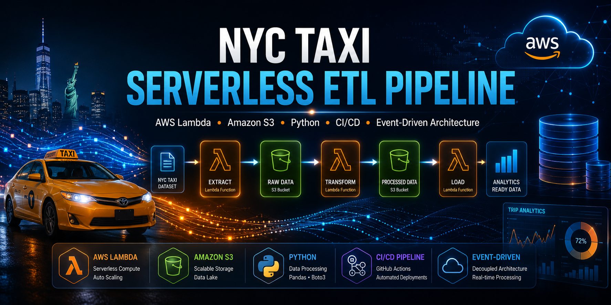
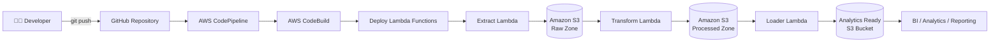
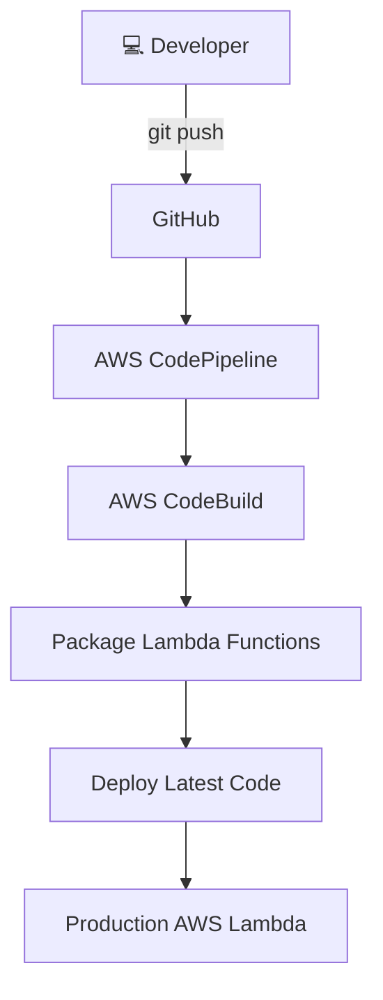

<div align="center">



<br>

# 🚕 NYC Taxi Serverless ETL & CI/CD Pipeline

### ⚡ Event-Driven Data Engineering on AWS

[](https://git.io/typing-svg)

<br>


</div>

---

# 📖 Project Overview

This project demonstrates a **production-inspired serverless ETL pipeline** built on AWS for processing historical **NYC Taxi Trip** datasets.

The pipeline follows an **event-driven architecture** where each processing stage is executed independently using AWS Lambda. Raw datasets are automatically ingested, transformed into standardized analytical datasets, and stored in Amazon S3 while AWS CodePipeline continuously deploys application updates whenever new code is pushed to GitHub.

---

# ✨ Key Features

- 🚀 Fully Serverless Architecture
- ⚡ Event-Driven ETL Workflow
- ☁️ AWS Lambda Compute
- 📦 Amazon S3 Data Lake
- 🔄 Automated CI/CD using AWS CodePipeline
- 🏗 AWS CodeBuild Integration
- 🐍 Python 3.11 Implementation
- 📊 Modular ETL Design
- 🔒 IAM Role-Based Security
- 📁 Structured Project Organization
- 🧹 Automated Data Cleaning
- 📈 Analytics-Ready Output

---

# 🛠 Technology Stack

<div align="center">

| Category | Technologies |
|----------|--------------|
| Programming | Python 3.11 |
| Cloud | AWS |
| Compute | AWS Lambda |
| Storage | Amazon S3 |
| CI/CD | AWS CodePipeline, AWS CodeBuild |
| Version Control | Git, GitHub |
| Data Processing | Pandas |
| Architecture | Serverless ETL |

</div>

---

# 🚀 Pipeline Highlights

<div align="center">

| 🚕 ETL Layer | 📌 Responsibility |
|--------------|------------------|
| 📥 Extract | Read external NYC Taxi dataset |
| 🔄 Transform | Clean, validate and standardize records |
| 📦 Load | Store analytics-ready dataset |

</div>

---

# 🌟 Why This Project?

Unlike a monolithic ETL application, this project separates every processing stage into dedicated AWS Lambda functions.

This architecture provides:

- Independent execution
- Better scalability
- Easier maintenance
- Lower operational cost
- Event-driven processing
- Cloud-native deployment
- Continuous delivery through CI/CD

---

# 📷 Project Preview

<div align="center">


<br><br>


</div>

---

# 📌 Repository Sections

- 🏗 Architecture
- ⚙️ ETL Workflow
- 🚀 CI/CD Pipeline
- 📂 Project Structure
- 🔐 IAM Security
- 📊 ETL Stage Details
- 📸 Screenshots
- 🧪 Local Testing
- ☁️ AWS Deployment
- 📈 Future Improvements

---
# 🏗️ System Architecture

This project follows an **event-driven serverless architecture** where each stage of the ETL pipeline is independently executed using AWS Lambda. Data is progressively refined across Amazon S3 storage layers while AWS CodePipeline automates deployments from GitHub.

<div align="center">


</div>

---

# ☁️ High-Level Architecture



---

# ⚙️ ETL Processing Workflow

<div align="center">

| Stage | AWS Service | Description |
|:------:|:-----------:|------------|
| 📥 Extract | AWS Lambda | Downloads NYC Taxi dataset and uploads raw files to Amazon S3 |
| 🔄 Transform | AWS Lambda | Cleans invalid records, standardizes schema and prepares processed dataset |
| 📦 Load | AWS Lambda | Stores analytics-ready output for downstream reporting |

</div>

---

# 🚀 CI/CD Deployment Workflow

Whenever new code is pushed to the **main** branch, the deployment pipeline is executed automatically.



---

# 📂 Data Flow

```text
                NYC Taxi Dataset
                        │
                        ▼
             Extract Lambda Function
                        │
                        ▼
          Amazon S3 (Raw Landing Zone)
                        │
                        ▼
           Transform Lambda Function
                        │
                        ▼
       Amazon S3 (Processed Dataset)
                        │
                        ▼
            Loader Lambda Function
                        │
                        ▼
       Amazon S3 (Analytics Ready)
```

---

# 🏛️ AWS Services Used

<div align="center">

| AWS Service | Purpose |
|-------------|---------|
| 🟠 AWS Lambda | Serverless compute for ETL stages |
| 🟢 Amazon S3 | Data Lake for Raw, Processed and Analytics datasets |
| 🔵 AWS CodePipeline | Continuous Integration & Continuous Deployment |
| 🟡 AWS CodeBuild | Build automation |
| 🔒 IAM | Secure permission management |

</div>

---

# 🎯 Architecture Highlights

## ⚡ Serverless Computing

- No servers to manage
- Automatic scaling
- Pay only for execution time

---

## 📂 Layered Data Lake

```
Raw Zone
      │
      ▼
Processed Zone
      │
      ▼
Analytics Zone
```

Each layer has a dedicated responsibility, making the pipeline modular and easy to maintain.

---

## 🔄 Event-Driven Processing

Every Lambda function executes independently after the previous stage completes, enabling a loosely coupled workflow.

---

## 🚀 Continuous Deployment

Every GitHub push automatically triggers:

```text
Git Push
   │
   ▼
GitHub
   │
   ▼
AWS CodePipeline
   │
   ▼
AWS CodeBuild
   │
   ▼
Deploy Updated Lambda Functions
```

---

# ✨ Design Principles

- ✅ Modular ETL Components
- ✅ Event-Driven Architecture
- ✅ Automated Deployment
- ✅ Serverless Infrastructure
- ✅ Cloud-Native Design
- ✅ Scalable Processing
- ✅ Maintainable Codebase
- ✅ Production-Inspired Workflow

---

# 📂 Repository Structure

```text
📦 nyc-taxi-pipeline
│
├── 📂 src
│   ├── 🚕 taxi_extractor_lambda.py
│   ├── 🔄 taxi_transformer_lambda.py
│   └── 📦 taxi_loader_lambda.py
│
├── 📂 assets
│   ├── 🖼 hero-banner.png
│   ├── 🏗 architecture.png
│   ├── 🎬 demo.gif
│   └── 📸 pipeline-output.png
│
├── ⚙ buildspec.yml
├── 📋 requirements.txt
├── 📖 README.md
└── 📄 LICENSE
```

---

# 🧩 Project Components

| Module | Description |
|----------|-------------|
| 🚕 Extract Lambda | Downloads or reads raw NYC Taxi dataset and uploads it to Amazon S3 |
| 🔄 Transform Lambda | Cleans data, validates schema, removes invalid records and standardizes columns |
| 📦 Loader Lambda | Stores analytics-ready datasets into the target storage layer |
| ⚙ CodeBuild | Packages Lambda source files into deployment artifacts |
| 🚀 CodePipeline | Automates CI/CD deployment from GitHub |

---

# ⚙ Build Automation

The project uses **AWS CodeBuild** together with **AWS CodePipeline** to automate deployments.

Whenever code is pushed to GitHub:

```text
Developer

↓

Git Push

↓

GitHub Repository

↓

AWS CodePipeline

↓

AWS CodeBuild

↓

Deploy Latest Lambda Code

↓

Pipeline Ready
```

---

# 📄 buildspec.yml

```yaml
version: 0.2

phases:
  install:
    runtime-versions:
      python: 3.11

  build:
    commands:
      - echo "Validating source code..."
      - echo "Preparing deployment artifacts..."

artifacts:
  files:
    - src/taxi_extractor_lambda.py
    - src/taxi_transformer_lambda.py
    - src/taxi_loader_lambda.py
```

---

# 📊 ETL Stage Matrix

| ETL Stage | Input | Processing | Output |
|-----------|-------|------------|--------|
| 📥 Extract | External Taxi Dataset | Download & Upload | Raw S3 Bucket |
| 🔄 Transform | Raw Dataset | Cleaning, Validation, Standardization | Processed S3 Bucket |
| 📦 Load | Processed Dataset | Analytics Preparation | Analytics Bucket |

---

# ☁️ Storage Layers

```text
┌────────────────────────────┐
│      Raw Landing Zone      │
└──────────────┬─────────────┘
               │
               ▼
┌────────────────────────────┐
│    Processed Data Zone     │
└──────────────┬─────────────┘
               │
               ▼
┌────────────────────────────┐
│   Analytics Ready Zone     │
└────────────────────────────┘
```

---

# 🔒 Security Best Practices

✔ IAM Role-Based Authentication

✔ Least Privilege Access

✔ No Hardcoded AWS Credentials

✔ GitHub Source Control

✔ Automated Deployments

✔ Serverless Compute Isolation

✔ Managed AWS Services

---

# 📸 Pipeline Preview

<div align="center">


</div>

---

# 🚀 Pipeline Features

<div align="center">

| Feature | Status |
|---------|:------:|
| Serverless Architecture | ✅ |
| Event Driven ETL | ✅ |
| Automated Deployment | ✅ |
| AWS Lambda | ✅ |
| Amazon S3 | ✅ |
| CodePipeline | ✅ |
| CodeBuild | ✅ |
| IAM Security | ✅ |
| Modular ETL | ✅ |
| CI/CD | ✅ |

</div>

---

# 📈 Pipeline Metrics

| Metric | Value |
|---------|-------|
| ETL Stages | 3 |
| AWS Services | 5 |
| Programming Language | Python 3.11 |
| Deployment Strategy | CI/CD |
| Architecture | Event Driven |
| Cloud Platform | AWS |

---

# 🧪 Local Development

Clone the repository

```bash
git clone https://github.com/Sushant-shringi/nyc-taxi-pipeline.git
```

Move into the project

```bash
cd nyc-taxi-pipeline
```

Install dependencies

```bash
pip install -r requirements.txt
```

Execute Lambda functions locally

```bash
python src/taxi_extractor_lambda.py

python src/taxi_transformer_lambda.py

python src/taxi_loader_lambda.py
```

---

# ☁️ AWS Deployment

Deployment is completely automated using AWS CodePipeline.

```text
Developer
      │
      ▼
Git Push
      │
      ▼
GitHub Repository
      │
      ▼
AWS CodePipeline
      │
      ▼
AWS CodeBuild
      │
      ▼
Lambda Deployment
      │
      ▼
Production Ready
```

---

# 📸 Project Gallery

## 🏗 Architecture

<div align="center">


</div>

---

## 🎬 Pipeline Demonstration

<div align="center">


</div>

---

## 📊 Pipeline Output

<div align="center">


</div>

---

# 🚀 End-to-End Pipeline Flow

```text
NYC Taxi Dataset
        │
        ▼
Extract Lambda
        │
        ▼
Amazon S3 (Raw)
        │
        ▼
Transform Lambda
        │
        ▼
Amazon S3 (Processed)
        │
        ▼
Loader Lambda
        │
        ▼
Analytics Ready Dataset
```

---

# 🎯 Key Learning Outcomes

During this project the following concepts were implemented and practiced:

- ✅ Event-Driven Architecture
- ✅ Serverless ETL Pipeline
- ✅ AWS Lambda Development
- ✅ Amazon S3 Data Lake Design
- ✅ AWS CodePipeline
- ✅ AWS CodeBuild
- ✅ IAM Role Management
- ✅ Automated Deployment
- ✅ GitHub Integration
- ✅ Cloud-Based Data Processing

---

# 💡 Challenges Solved

| Challenge | Solution |
|-----------|----------|
| Lambda deployment automation | AWS CodePipeline |
| Artifact packaging | AWS CodeBuild |
| Data quality validation | Python transformation layer |
| Decoupled architecture | Independent Lambda functions |
| Storage organization | Layered Amazon S3 buckets |

---

# 📈 Future Improvements

- Amazon EventBridge Integration

- AWS Step Functions Orchestration

- Amazon Athena Analytics

- Amazon QuickSight Dashboard

- AWS Glue Data Catalog

- CloudWatch Monitoring

- SNS Notifications

- Data Quality Reports

- Unit Testing

- Infrastructure as Code (Terraform)

---

# 📚 Skills Demonstrated

<div align="center">

| Cloud | Programming | DevOps | Data Engineering |
|-------|-------------|---------|-----------------|
| AWS Lambda | Python | Git | ETL |
| Amazon S3 | Pandas | GitHub | Data Cleaning |
| IAM | Boto3 | CodePipeline | Data Validation |
| CodeBuild | JSON | CI/CD | Serverless |

</div>

---

# ⭐ Project Highlights

- ☁️ Cloud Native
- ⚡ Serverless
- 🚀 Automated Deployment
- 📦 Modular Architecture
- 🔄 Event Driven
- 📊 Analytics Ready
- 🔒 Secure IAM Access
- 💻 Production Inspired

---

# 🙌 Acknowledgements

This project was developed to strengthen practical knowledge of **AWS Serverless**, **Python ETL**, **Cloud Deployment**, and **CI/CD automation** by implementing a complete end-to-end data engineering workflow.

---
---

# 📌 Project Roadmap

- ✅ Build Serverless ETL Pipeline
- ✅ Create Event-Driven Architecture
- ✅ Configure Amazon S3 Storage Layers
- ✅ Develop AWS Lambda Functions
- ✅ Automate Deployment using CodePipeline
- ✅ Integrate AWS CodeBuild
- ✅ Validate Data Transformation
- 🔄 Add CloudWatch Monitoring
- 🔄 Integrate EventBridge
- 🔄 Build QuickSight Dashboard

---

# 📊 Project Summary

<div align="center">

| Category | Details |
|-----------|----------|
| 🚕 Project | NYC Taxi Serverless ETL Pipeline |
| ☁ Cloud | Amazon Web Services |
| 🐍 Language | Python 3.11 |
| ⚡ Compute | AWS Lambda |
| 📦 Storage | Amazon S3 |
| 🚀 Deployment | AWS CodePipeline |
| 🛠 Build | AWS CodeBuild |
| 🏗 Architecture | Event-Driven |
| 📈 Pipeline | Serverless ETL |

</div>

---

# 💼 Recruiter Highlights

✔ Event-Driven Serverless Architecture

✔ End-to-End ETL Pipeline

✔ AWS Lambda Development

✔ Amazon S3 Data Lake

✔ Python Data Processing

✔ Automated CI/CD Pipeline

✔ IAM Role Management

✔ Production-Inspired Cloud Workflow

---

# 🏆 Technical Skills Demonstrated

<div align="center">


</div>

<br>

| Domain | Skills |
|---------|--------|
| Cloud Computing | AWS Lambda, Amazon S3, IAM |
| Programming | Python |
| DevOps | Git, GitHub, AWS CodePipeline, CodeBuild |
| Data Engineering | ETL Pipeline, Data Cleaning, Data Validation |
| Architecture | Serverless, Event-Driven |

---

# 🌟 Repository Highlights

<div align="center">

| Feature | Available |
|---------|:---------:|
| Modular Codebase | ✅ |
| Event-Driven Pipeline | ✅ |
| Serverless Compute | ✅ |
| Automated Deployment | ✅ |
| IAM Security | ✅ |
| CI/CD Integration | ✅ |
| Clean Documentation | ✅ |

</div>

---

# 🤝 Contributing

Contributions are welcome.

If you have suggestions to improve this project:

- Fork the repository
- Create a feature branch
- Commit your changes
- Open a Pull Request

---

# ⭐ Support

If you found this repository helpful, consider giving it a ⭐ on GitHub.

It helps support the project and motivates future improvements.

---

# 👨‍💻 Author

<div align="center">

## Sushant Shringi

**Aspiring Data Engineer**

Python • SQL • AWS • ETL • CI/CD

<br>

<a href="https://github.com/Sushant-shringi">

</a>

<a href="https://linkedin.com/in/sushant-shringi">

</a>

<a href="mailto:Sushantshringi444@gmail.com">

</a>

</div>

---

<div align="center">

## ⭐ If you like this project, don't forget to Star the Repository ⭐


</div>
